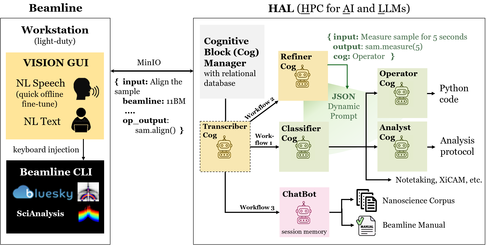
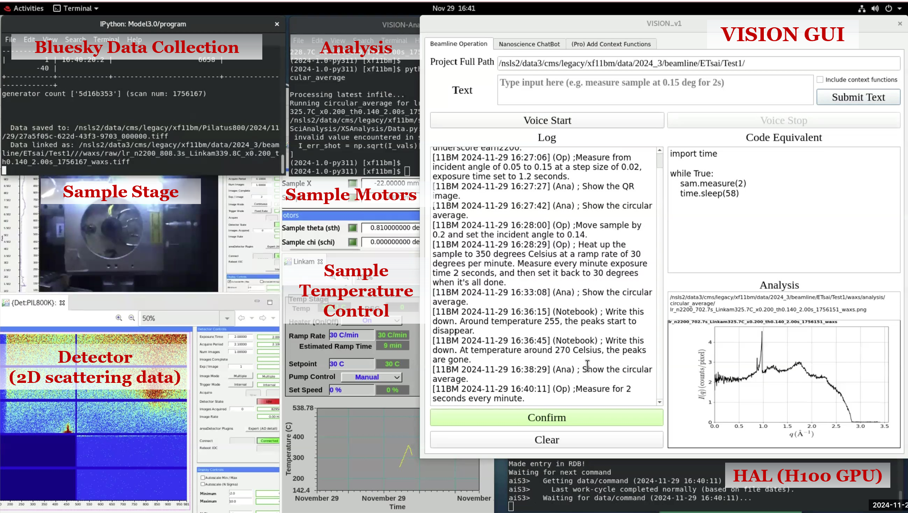

# VISION: A Modular AI Assistant for Natural Human-Instrument Interaction at Scientific User Facilities

VISION (Virtual Scientific Companion) is an AI-driven assistant designed to streamline operations at synchrotron beamlines and scientific facilities through natural language interaction. Built on a modular architecture, VISION is an assembly of **Cognitive Blocks (Cogs)**—specialized AI components tailored for tasks like transcription, classification, code generation, data analysis, and scientific querying. These cogs operate in predefined **workflows**, enabling seamless communication between users and complex instrumentation.

Key workflows include natural language-controlled (audio, text, or both) **beamline operations**, where commands are classified, converted to executable code, and deployed for data acquisition or analysis; **custom function addition**, where custom functions defined by the user in natural language are dynamically integrated into the system; and a **domain-specific chatbot**, capable of answering scientific queries with precision. 



*Figure 1: Overview of the VISION architecture*



*Figure 2: VISION deployment at NSLS-II 11-BM CMS: GUI was launched at the beamline workstation, with backend processing performed on HAL. LLM-based cog results are displayed to prompt user confirmation, followed by execution on Bluesky or other software.*


## Paper
Please see our paper here - https://arxiv.org/abs/2412.18161

## Directory Structure
Highlight of the most important files:
```
📁 VISION/
├── 📁 backend/
│   ├── 📁 src/
│   │   └── 📁 hal_beam_com/
│   │       └── cog_manager.py      (main entry-point for backend)
│   └── 📁 tests/                   (contains testing framework to generate evaluate LLMs on our datasets)
└── 📁 frontend/
    └── 📁 UI/
        └── 📁 program/
            └── executable.py        (main entry-point for front-end)
```

## $${\color{red}Getting \space Started \space Guide}$$

This guide includes I. Installation, II. Running the System, III. Configuration, and IV. Adding Functionality.

### I. Installation

#### Python Requirements
Both frontend and backend require Python 3.12.7. Different versions might work but are mostly untested.

#### Frontend Installation
1. Navigate to the frontend directory:
   ```bash
   cd frontend
   ```

2. Create a virtual environment:
   ```bash
   python -m venv .venv
   ```

3. Activate the virtual environment:
   - **Windows:**
     ```bash
     .\.venv\Scripts\Activate.ps1  # or .\.venv\Scripts\activate.bat
     ```
   - **Linux/MacOS:**
     ```bash
     source .venv/bin/activate
     ```

4. Install required packages:
   ```bash
   pip install -r requirements.txt
   ```

5. For beamline key insertion functionality (Linux only):
   ```bash
   sudo apt-get install xdotool
   ```

#### Backend Installation
1. Navigate to the backend directory:
   ```bash
   cd backend
   ```

2. Create a virtual environment:
   ```bash
   python -m venv .venv
   ```

3. Activate the virtual environment:
   - **Windows:**
     ```bash
     .\.venv\Scripts\Activate.ps1  # or .\.venv\Scripts\activate.bat
     ```
   - **Linux/MacOS:**
     ```bash
     source .venv/bin/activate
     ```

4. Install required packages:
   ```bash
   pip install -r requirements.txt
   ```

5. Set up the Anthropic API Key:
   - **Windows:**
     ```cmd
     setx ANTHROPIC_API_KEY "your_secret_key_value"
     ```
     Restart your IDE for changes to take effect.
   
   - **Linux/MacOS:**
     ```bash
     echo 'export ANTHROPIC_API_KEY="your_secret_key_value"' >> ~/.bashrc
     source ~/.bashrc  # or ~/.zshrc for zsh users
     ```

6. Alternative Model Configuration: In this public repository, Claude's models are used by default. This is so one does not need a GPU to run large open-source models locally.
   If you prefer not to use Claude's Anthropic model, you can switch the model setup by changing the `ACTIVE_CONFIG` in `./backend/src/hal_beam_com/utils.py`. Though, most models (except GPT-4o) will require having Ollama installed.

### II. Running the System

#### Starting the Frontend
After installation, run the frontend with:
```bash
cd frontend
python ./UI/program/executable.py
```

#### Starting the Backend
After installation, run the backend with:
```bash
cd backend
python ./src/hal_beam_com/cog_manager.py
```


### III. Configuration Options
#### Connection Between Frontend and Backend
VISION supports three methods for the communication between frontend and backend:

1. **Local Filesystem (Default)** 
   - The simplest option for local testing and development
   - This is the default setting in this public repository. No additional configuration required
   - Data is transferred through files in a shared filesystem
   - If the commands become desynced, you can clear the temp folder to resolve it

2. **SSH Connection**
   - For connecting to a remote backend server
   - Requires SSH access to the backend machine
   - All communication goes through the server, credentials should be that of the server in both files
   - To enable, replace `CustomS3.py` with `SSH<Backend|Frontend>CustomS3.py` in both frontend and backend
   - Configure in both frontend and backend CustomS3.py files:
     ```python
     username = "your_username"
     endpoint = "backend_server_address"
     password = "your_password"  # Or use SSH keys instead
     ```

3. **Minio S3**
   - For scalable, production deployments
   - Requires a Minio S3 server
   - To enable, replace `CustomS3.py` with `MinioCustomS3.py` in both frontend and backend
   - Configure connection details in the MinioCustomS3.py files

#### Connection Between Frontend and Instruments
Currently, VISION uses keyboard injection for simple deployment; proper integration to the instrument control framework is recommended (work in progress).

1. **Keyboard Injection (xdotool)**
   - Simulates keyboard inputs to control existing instrument interfaces
   - Requires xdotool on Linux (installed with `sudo apt-get install xdotool`)
   - Used by default in the `executeCommand` method in frontend/UI/program/executable.py

However, integration to the instrument control framework should be utilized, for example,

2. **Direct API Integration**
   - For instruments with programmable interfaces
   - Configure custom command handlers in the backend
   - Requires specific knowledge of the instrument's API


### IV. Adding/Extending Functionality
#### Adding Instrument/Command Support
To add support for new instruments or add new functions to the current instrument, you just need to create/modify JSON entries (in `/backend/src/hal_beam_com/beamline_prompts
/11BM/command_examples.json`) that define their respective commands. 
For each instrument, a corresponding folder and json is needed, e.g. `/11BM/command_examples.json`, `/12ID/command_examples.json`. 

1. **Define a new function in JSON format:**
   ```json
   {
        "class": "Sample Measurement Commands",
        "title": "Snap (Measure Sample without Saving)",
        "function": "sam.snap(exposure_time)",
        "params": [
            {
                "name": "exposure_time",
                "type": "int",
                "description": "seconds"
            }
        ],
        "notes": [
            "This command measures the sample but does not save the data."
        ],
        "usage": [
            {
                "input": "Measure sample for 5 seconds but don't save the data.",
                "code": "sam.snap(5)"
            }
        ],
        "example_inputs": [
            "Measure sample 2 seconds, no save."
        ],
        "default": true,
        "cog": "Op"
   }
   ```

   Only the title and function fields are required. If default is `False`, the functions will be put under "Miscellaneous Commands". However, using the fields offered allows for more specificity, which in turn can yield higher performance. The above JSON entry is formatted as the following in the prompt:
   ```
   - **Sample Measurement Commands:**
       - **Snap (Measure Sample without Saving):**
        `sam.snap(exposure_time)`

        - Params:
            - exposure_time: int (seconds)

        - Notes:
            - This command measures the sample but does not save the data.

        - Usage:
            - "Measure sample for 5 seconds but don't save the data."
                - `sam.snap(5)`

        - Example phrases:
            - "Measure sample 2 seconds, no save."
   ```

3. **Using the dynamic function creation workflow:**
   - You can also add functions through the natural language UI. This is for quick-adding functionality during online operation. Note that for deploying VISION to a new instrument, it is recommended to create/modify command_examples.json instead of using the UI.
   - Describe the function and its parameters in natural language, and then the system will generate the appropriate JSON and code implementations.
   - Cons: sophisticated format not supported, and requires access to a specific model (GPT-4o, used for JSON support)


## Contact

Feel free to reach out to us for any questions or installation issues. Suggestions/feedback are also appreciated! Esther Tsai (etsai@bnl.gov)

## Citation
```bibtex
@misc{mathur2024visionmodularaiassistant,
      title={VISION: A Modular AI Assistant for Natural Human-Instrument Interaction at Scientific User Facilities}, 
      author={Shray Mathur and Noah van der Vleuten and Kevin Yager and Esther Tsai},
      year={2024},
      eprint={2412.18161},
      archivePrefix={arXiv},
      primaryClass={cs.AI},
      url={https://arxiv.org/abs/2412.18161}, 
}
```
